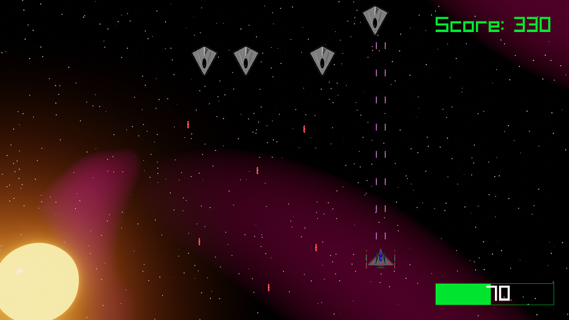

  

<h3 align="center">Space shooter</h3>

---

 Few lines describing your project.
SpaceShooter with arcade mode and campaign mode in progress
      

## 📝 Table of Contents

- [Getting Started](#getting_started)
- [Deployment](#deployment)
- [Built Using](#built_using)
- [Authors](#authors)

## 🏁 Getting Started 

### Install raylib - checkout [raylib wiki](https://github.com/raysan5/raylib/wiki) for instructions.
### [Install boost](https://www.boost.org/) 

### Prerequisites

raylib and boost

## ⛏️ Built Using 

- [raylib](https://www.raylib.com/) - Game engine
- [boost](https://boost.org/) - External files

## ✍️ Authors 

- [@scalerow](https://github.com/scalerow) - Idea & Initial work